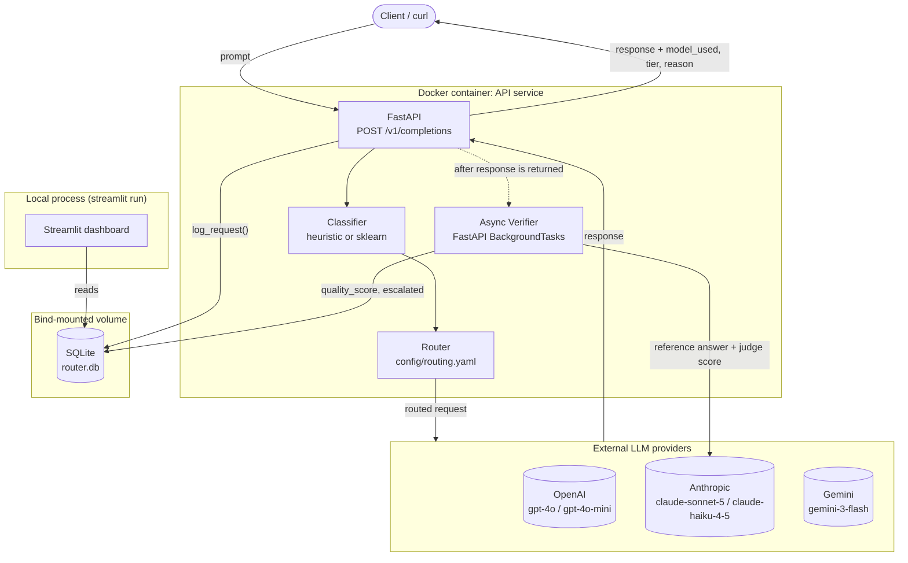
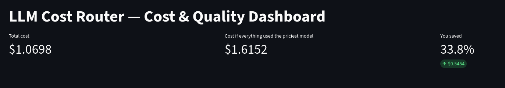
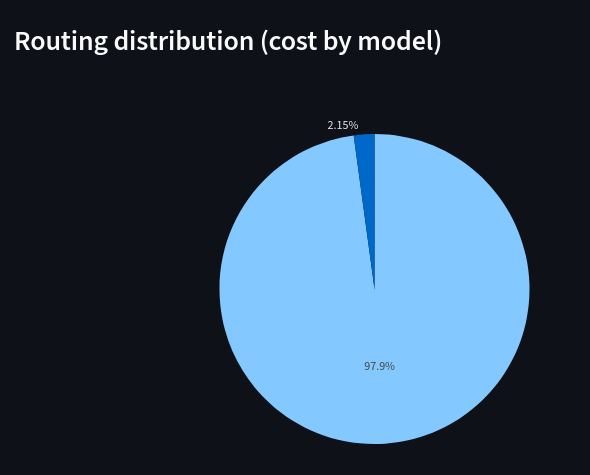
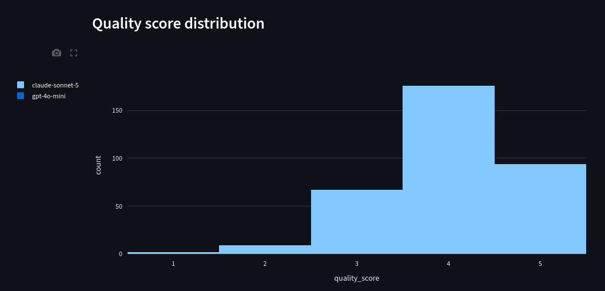

# LLM Cost Router

A routing layer that sits in front of multiple LLM providers, scores each
incoming prompt's complexity, and sends it to the cheapest model that can
actually handle it — instead of defaulting every request to a top-tier model
"just in case."

## The problem

Most teams calling LLMs in production route every request to one model,
usually whichever one is good enough for their hardest prompts. That means a
six-word factual question ("What is the capital of France?") gets billed at
the same per-token rate as a multi-step reasoning task, even though the
cheapest model in this project's registry is **~20x cheaper per input token
and ~25x cheaper per output token** than the most expensive one. At any
real volume, that gap is pure waste.

## How it works

1. **Classify.** Every prompt is scored into a complexity tier — Tier 1
   (simple Q&A/extraction/reformatting), Tier 2 (summarization/
   classification), or Tier 3 (multi-step reasoning, creative generation,
   nuanced judgment) — by a hand-tunable heuristic classifier, or optionally
   a scikit-learn model trained on 200+ labeled examples.
2. **Route.** A YAML config (`config/routing.yaml`, hot-swappable via
   `PUT /v1/routing-config`) maps each tier to a real model across OpenAI,
   Anthropic, and Gemini.
3. **Verify, asynchronously.** After the cheap response is already back with
   the caller, a background job independently re-answers the same prompt
   with the highest-tier "judge" model and scores agreement. A bad score
   marks the request `escalated` and becomes a new training example — the
   feedback loop that lets the classifier improve over time.
4. **Log everything.** Every request lands in SQLite with cost, latency,
   tier, and (once verification finishes) a quality score — the audit trail
   behind the cost dashboard below.

## Architecture



`config/` is bind-mounted alongside `data/`, so `routing.yaml` can be edited
on the host and picked up without a rebuild. The dashboard is a separate
process — it reads `router.db` directly rather than calling the API.

## Results

From a 492-prompt load test sent through the live, running API (real,
diverse prompts spanning all three tiers — see
[Load test](#load-test) below):

| Metric | Value |
|---|---|
| Requests completed | 390 |
| Actual cost | $1.0698 |
| Cost if every request had used the priciest model instead | $1.6152 |
| **Savings** | **$0.5454 (33.8%)** |

That blended number undersells what routing does on a per-request basis, and
it's worth explaining why: **89% of requests (348/390) were routed to the
cheapest model at an average of $0.00007/request, while the 11% that
genuinely needed the top-tier model averaged $0.025/request — 377x more.**
Cost in LLM workloads is concentrated in a small tail of hard prompts, not
spread evenly across traffic. The 33.8% blended figure reflects that: it's
the real number, not a cherry-picked one, and it's exactly the kind of
result you'd expect once the "easy" 89% of a workload stops subsidizing
top-tier pricing for everyone.

*(Methodology note: 112 of the 492 load-test prompts were correctly
classified as Tier 2 but failed at the provider level — the Gemini key used
for `tier_2` has no funding in this run — so they're excluded from both the
actual and baseline totals rather than counted as either a cost or a
savings. See [Known limitations](#known-limitations).)*



## Setup

```bash
python3 -m venv .venv
source .venv/bin/activate
pip install -e ".[dev,dashboard,ml]"
cp .env.example .env   # then fill in OPENAI_API_KEY / ANTHROPIC_API_KEY / GEMINI_API_KEY
```

## Run the tests

```bash
pytest tests/
```

## Run the API

```bash
uvicorn llm_cost_router.api.app:app --reload --app-dir src --port 8000
```

```bash
curl -X POST localhost:8000/v1/completions \
  -H 'Content-Type: application/json' \
  -d '{"prompt": "What is the capital of France?"}'
```

Routing tiers are configured in [config/routing.yaml](config/routing.yaml);
edit the tier -> model mapping there without touching code (validated against
the model registry at startup).

Every request is logged to a local SQLite file (`data/router.db`, gitignored).
After each cheap-tier response returns, a background task re-answers the
prompt with the judge model (`claude-sonnet-5`), scores agreement via
LLM-as-judge, and writes `quality_score` back onto the log row - a score
below 3.0 marks the row `escalated=true` with the cost delta. See
[docs/ROADMAP.md](docs/ROADMAP.md) (local-only, gitignored) for the full
step-by-step design.

```bash
curl localhost:8000/v1/models
curl localhost:8000/v1/stats
```

Routing can also be hot-swapped at runtime without a restart:

```bash
curl -X PUT localhost:8000/v1/routing-config \
  -H 'Content-Type: application/json' \
  -d '{"routing": {"tier_1": "claude-haiku-4-5", "tier_2": "gemini-3-flash", "tier_3": "claude-sonnet-5"}}'
```

Validated the same way as `config/routing.yaml` at startup (unknown model ids
are rejected with `422` and the previous config stays in effect) - the change
only lives in memory for the running process, `config/routing.yaml` on disk
is untouched.

## Cost dashboard

```bash
streamlit run dashboard/app.py
```

Reads directly from `data/router.db`: headline cost-savings metrics, cost
per day vs. an all-priciest-model baseline, escalation rate over time,
routing distribution by model, and quality score distribution.

| Routing distribution (cost by model) | Quality score distribution |
|---|---|
|  |  |

The pie chart shows 97.9% of spend still went to the priciest model
(`claude-sonnet-5`, tier 3) against 2.15% for `gpt-4o-mini` (tier 1) — the
concentrated-tail effect described in [Results](#results): tier 3 gets a
small share of *requests* but dominates *cost*. The quality histogram shows
the async verifier's agreement scores for cheap-tier responses, mostly
clustered at 4-5 (candidate agreed with the judge model), which is what
keeps the escalation rate low.

## Baseline test script

Sends a fixed prompt set to every registered model and reports cost/latency
per model. Makes real, paid API calls.

```bash
python scripts/baseline_test.py
```

## Load test

Generates ~500 diverse prompts and sends them through the live, running API
(exercising classification, routing, logging, and async verification end to
end, not just direct provider calls):

```bash
python scripts/generate_load_test_prompts.py   # regenerate data/prompts/load_test_prompts.json (optional, already tracked)
python scripts/load_test.py --concurrency 5     # requires the API already running
curl localhost:8000/v1/stats                    # final report
```

Prompt set: 229 prompts reused from the classifier's labeled dataset plus
~270 new prompts across fresh topic pools, deduplicated (`data/prompts/load_test_prompts.json`).
Results land in `data/results/load_test_<timestamp>.json`. See
[Results](#results) above for the numbers from the most recent run.

## Classifier: heuristic vs. sklearn

The default classifier is a hand-coded heuristic (`classifier/heuristic.py`).
A scikit-learn LogisticRegression classifier is also available, trained on a
200+ example labeled dataset (`data/labeled_prompts.json`, tracked in git) built
from tier-targeted templates rather than manually typed one-by-one - see the
docstring in `scripts/generate_labeled_dataset.py` for why. To use it:

```bash
python scripts/generate_labeled_dataset.py   # regenerate the labeled dataset (optional, already tracked)
python scripts/train_classifier.py           # trains + prints accuracy/confusion matrix, saves data/classifier_model.joblib
CLASSIFIER=sklearn uvicorn llm_cost_router.api.app:app --app-dir src --port 8000
```

The trained model file is gitignored (a regenerable build artifact) - run
`train_classifier.py` once after cloning before setting `CLASSIFIER=sklearn`.

## Classifier feedback loop

When the async verifier (`verification/verifier.py`) escalates a cheap-tier
response (quality score below 3.0), it also records a `classifier_failures`
row: the actual prompt text, the tier the classifier picked, and the tier it
should have picked (the judge model's tier). This is a deliberate, narrow
exception to `request_log`'s hash-only privacy policy - only escalated
requests get their prompt text retained, and only for retraining.

```bash
python scripts/retrain_classifier.py
```

Merges accumulated failures into the base labeled dataset, evaluates both the
baseline and merged model on the same held-out split, and only swaps in the
new model file if it doesn't regress. This is manually triggered for now - an
automated weekly schedule is a follow-up, not built here.

## Docker

```bash
cp .env.example .env   # fill in real keys, or leave placeholders to smoke-test
docker compose up --build
```

```bash
curl localhost:8000/v1/models
```

`data/` and `config/` are bind-mounted, so `router.db` and the sklearn model
persist across container restarts, and `config/routing.yaml` can be edited on
the host without rebuilding. No separate worker container - verification runs
as an in-process FastAPI background task, not a real task queue. `.env` is
optional; the API starts fine without it and only fails at request time if a
key is missing.

## Known limitations

- **Tier 2 requires a funded Gemini key.** `config/routing.yaml` maps
  `tier_2` to `gemini-3-flash`; without billing enabled on that key, every
  Tier 2 request fails at the provider (502) and is excluded from
  `/v1/stats` rather than counted. Swap `tier_2` to a funded model (e.g.
  `claude-haiku-4-5`, already registered) to exercise all three tiers.
- **Verifier cost isn't logged.** The async verifier's two judge-model calls
  per request (reference answer + agreement score) are real, billed API
  calls but aren't written to `request_log` or counted in `/v1/stats` — the
  dashboard's cost figures reflect only the primary completion path.
- **No local model.** Ollama was evaluated and removed; all three registered
  providers are paid cloud APIs.
